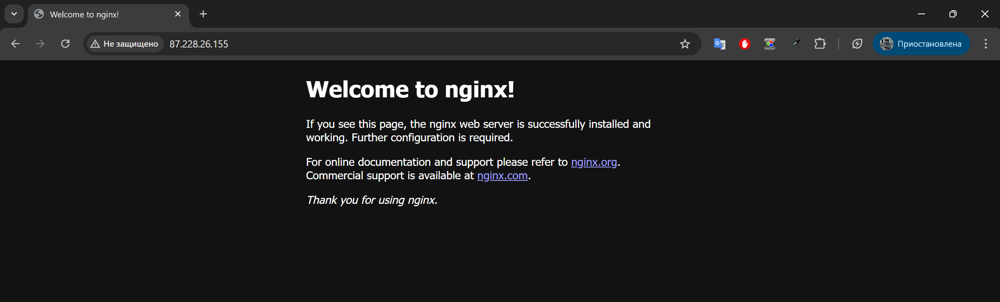
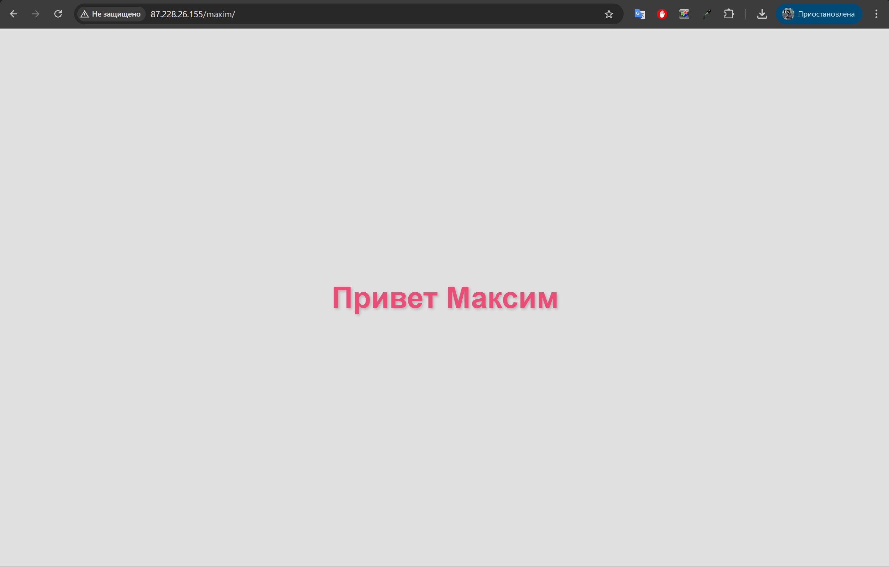
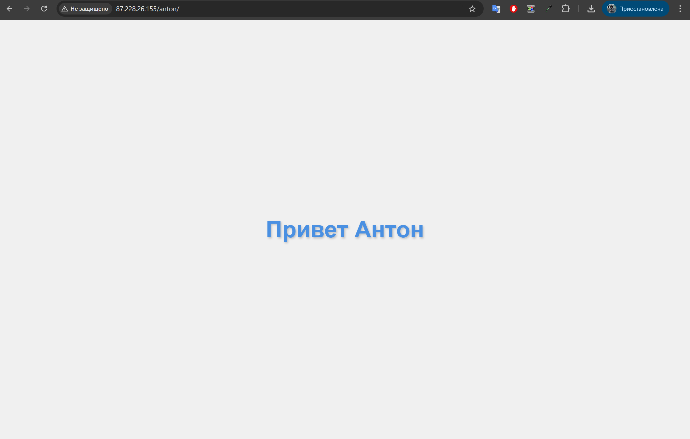
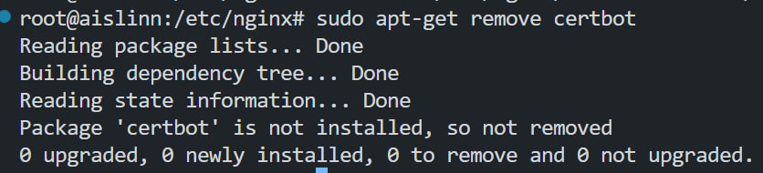
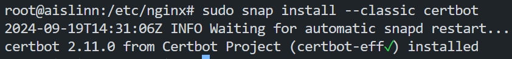
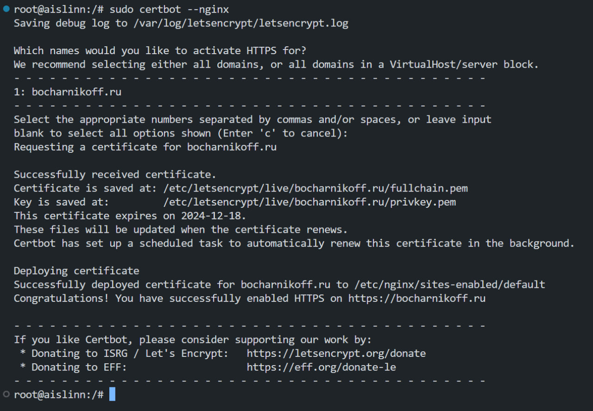
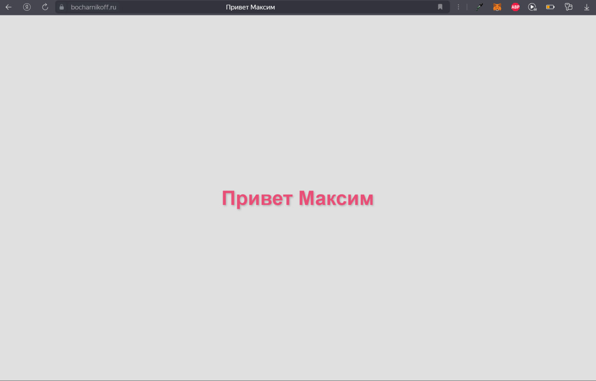
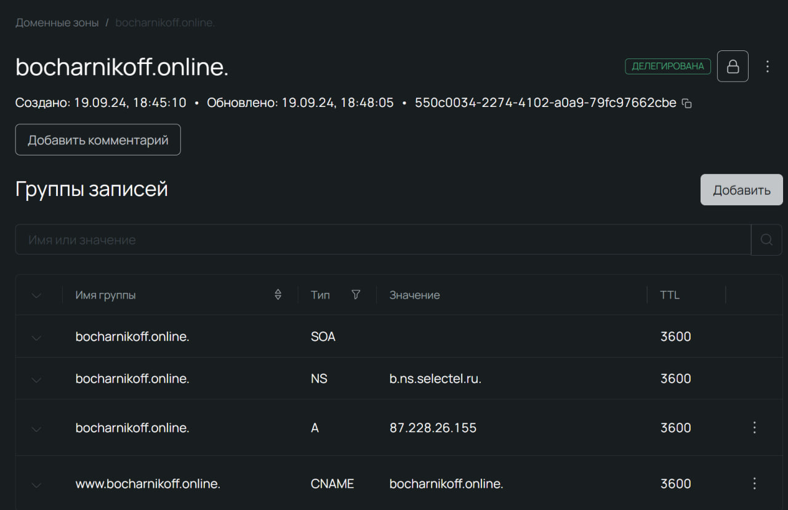
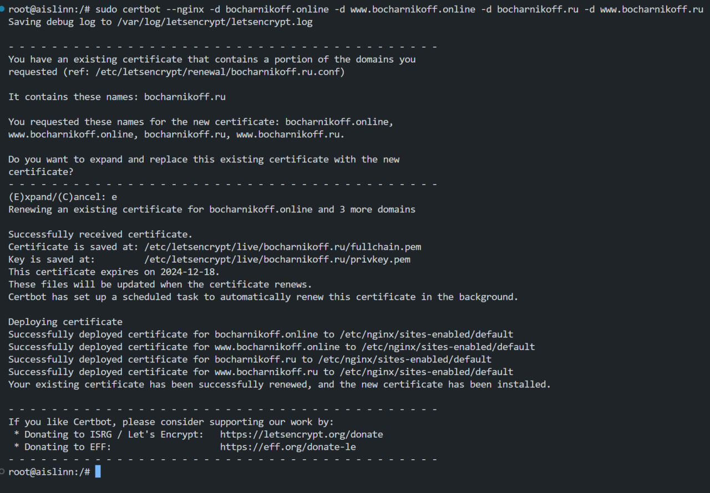

# Лабораторная работа по предмету "Облачные технологии и услуги"

## Техническое задание

1. **Должен работать по HTTPS с сертификатом**
   
2. **Настроить принудительное перенаправление HTTP-запросов (порт 80) на HTTPS (порт 443)**
   
3. **Использовать alias для создания псевдонимов путей к файлам или каталогам на сервере**
   
4. **Настроить виртуальные хосты для обслуживания нескольких доменных имен на одном сервере**
   
5. **Что угодно еще под требования проекта**

## Начало работы

1. **Аренда облачного сервера и подключение:**

   - Мы арендовали облачный сервер и установили соединение по SSH-ключу.
   - Подключились через SSH-Remote в VS Code.

2. **Обновление пакетов:**

   ```bash
   sudo apt update
   ```

3. **Установили git и nginx**

    ```bash
    sudo apt install git nginx 
    ```

4. **Hello, Nginx!**

    

    Как мы видим, nginx работает, а это значит мы на правильном пути

4. **Начальная настройка nginx`a**

    - Мы скопировали нужные файлы для работы лабы и переместили их по путям /var/www/Anton/ и /var/www/Maxim/ и сразу прописали алиасы 

    Вот что у нас получилось 

    ```nginx
    server {
        listen 80;
        server_name 87.228.26.155;

        location /anton/ {
            alias /var/www/Anton/;
            try_files $uri /index.html =404;
        }

        location / {
            alias /var/www/Maxim/;
            try_files $uri /index.html =404;
        }

        error_page 404 /404.html;
        location = /404.html {
            root /var/www/html;
            internal;
        }
    }
    ```
    
     

## Домен 

1. **Подключение домена** 

    - За кадром мы успели купить домен bocharnikoff.ru
    - Осталось его подключить (и подождать делегирования домена)
    
2. **Ожидание делегирование**

    - Спустя пару часов домен подключили к нашему ip-адресу и теперь мы имеем

    ```nginx 
    server {
        listen 80;
        server_name bocharnikoff.ru;

        location /anton/ {
            alias /var/www/Anton/;
            try_files $uri /index.html =404;
        }

        location / {
            alias /var/www/Maxim/;
            try_files $uri /index.html =404;
        }

        error_page 404 /404.html;
        location = /404.html {
            root /var/www/html;
            internal;
        }
    }
    ```
## Получение SSL-сертификата и настройка перенаправления

1. **Будем мы работать через certbot, поэтому проходимся по документации на их сайте:** 

    ```bash
    sudo apt-get remove certbot
    ```

        

    - Для команды на следующем шаге, нужно установить: 
        ```bash
        sudo apt-get install snapd
        ```

    ```bash
    sudo snap install --classic certbot
    ```

        

    - Переходим в корень системы и прописываем: 
        ```bash
        sudo ln -s /snap/bin/certbot /usr/bin/certbot
        ```
    
    ```bash
    sudo certbot --nginx
    ```
    
        

    - И вот мы получили наш сертификат, а certbot автоматически настроил нам nginx-файл

        
    
    - Код конфигурации:

        ```nginx 
        server {
            listen 80;
            server_name bocharnikoff.ru www.bocharnikoff.ru;

            return 301 https://$host$request_uri;
        }

        server {
            listen 443 ssl;
            server_name bocharnikoff.ru www.bocharnikoff.ru;

            ssl_certificate /etc/letsencrypt/live/bocharnikoff.ru/fullchain.pem; 
            ssl_certificate_key /etc/letsencrypt/live/bocharnikoff.ru/privkey.pem; 
            include /etc/letsencrypt/options-ssl-nginx.conf; 
            ssl_dhparam /etc/letsencrypt/ssl-dhparams.pem; 

            location /anton/ {
                alias /var/www/Anton/;
                try_files $uri /index.html =404;
            }

            location / {
                alias /var/www/Maxim/;
                try_files $uri /index.html =404;
            }

            error_page 404 /404.html;
            location = /404.html {
                root /var/www/html;
                internal;
            }
        }

        ```

## Подключение ещё одного домена (по сути будет 4 домена) 

1. **Нужно проделать те же самые операции, как и с подключением первого домена, и дождаться делегации**
    
     

2. **Наш конфигурационный файл стал содержать следующие домены:**

    ```bash
    server_name bocharnikoff.ru www.bocharnikoff.ru bocharnikoff.online www.bocharnikoff.online
    ```

3. **Пропишем эту команду и рестартнем nginx**

    ```bash
    sudo certbot --nginx -d bocharnikoff.online -d www.bocharnikoff.online -d bocharnikoff.ru -d www.bocharnikoff.ru
    ```

    ```bash
    sudo systemctl restart nginx
    ```

    

4. **Код конфигурации стал таким:** 
    ```nginx
    server {
        if ($host = www.bocharnikoff.ru) {
            return 301 https://$host$request_uri;
        } 


        if ($host = bocharnikoff.ru) {
            return 301 https://$host$request_uri;
        }


        if ($host = www.bocharnikoff.online) {
            return 301 https://$host$request_uri;
        }


        if ($host = bocharnikoff.online) {
            return 301 https://$host$request_uri;
        }


        listen 80;
        server_name bocharnikoff.ru www.bocharnikoff.ru bocharnikoff.online www.bocharnikoff.online;

        return 301 https://$host$request_uri;

    }

    server {
        listen 443 ssl;
        server_name bocharnikoff.ru www.bocharnikoff.ru bocharnikoff.online www.bocharnikoff.online;
        ssl_certificate /etc/letsencrypt/live/bocharnikoff.ru/fullchain.pem; 
        ssl_certificate_key /etc/letsencrypt/live/bocharnikoff.ru/privkey.pem; 
        include /etc/letsencrypt/options-ssl-nginx.conf; 
        ssl_dhparam /etc/letsencrypt/ssl-dhparams.pem; 

        location /anton/ {
            alias /var/www/Anton/;
            try_files $uri /index.html =404;
        }

        location / {
            alias /var/www/Maxim/;
            try_files $uri /index.html =404;
        }

        error_page 404 /404.html;
        location = /404.html {
            root /var/www/html;
            internal;
        }

    }
    ```

## А это и конец уже 

